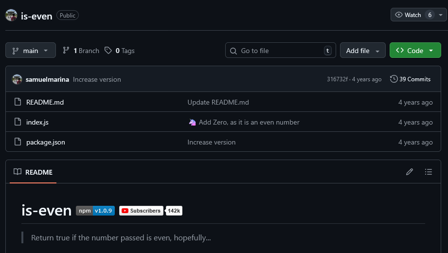

When it comes to designing and writing software systems there's **a lot** of factors to take into account.  
A developer has to balance all of these to create a flexible system, that balance is rarely easy.

Having the "perfect" codebase doesn't exist. Every codebase has its weaknesses.  
Quick fixes, hacks, legacy code, etc...

In this blog post I talk about my personal experience towards trying to make that codebase at least... a little bit cleaner.

<!--more-->

# First Hello World

I started my programming journey wanting to create games on ROBLOX.  
As a kid, I consulted YouTube videos on how to program in Lua.

Back then, I didn't really _know_ anything about programming let alone how to keep everything clean and maintainable.  
Did it really matter? Hell no.

After that, I tried web development which was my first introduction to JavaScript.  
I created simple applications or API's which ran on Node.js.

And looking back, oh boy.  
Immediately I recognize:

- Incorrect indentation
- [God files/objects](https://en.wikipedia.org/wiki/God_object) (literally all of the logic in 1 file)
- [Magic numbers](<https://en.wikipedia.org/wiki/Magic_number_(programming)>)
- [Nesting](https://www.youtube.com/watch?v=CFRhGnuXG-4) to the point it wouldn't fit on the screen
- [Terrible variable naming](https://www.youtube.com/watch?v=-J3wNP6u5YU)
- No comments

Among more things, I now recognize as [code smells](https://refactoring.guru/refactoring/smells).

To be fair, these are the mistakes most beginners make.

# Goal

That makes me question, what **have** I learned so far?  
It's not like I wrote it down somewhere.  
I just know from experience that certain things work, and certain things don't.

That's what this blog post is about.

This blog post is not a tutorial or overview of clean code, software design and the likes.  
Trust me, I am not experienced enough to know what I'm talking about.

Instead, this blog post is more or less my personal experience when it comes to clean code and software design.  
What's worked, what hasn't, and what I'm still figuring out.

# Table of contents



# To composite or to abstract?

> Favor composition over inheritance.

Inheritance is a powerful tool, but it has it's drawbacks.

Which brings me to the not-so-distant past.  
In highschool I got my first interaction with an [OOP](https://en.wikipedia.org/wiki/Object-oriented_programming) language: C#.

And whilst I didn't exactly start using OOP structures in the beginning, I eventually learned to use them.

Fast-forward a bit later to college, for a class we had to make a [game](https://github.com/thoricelli/Chips-challenge-monogame) in the MonoGame engine whilst using SOLID principles and design patterns.

I can't say I'm terribly proud of the code I wrote there, it's a bit of a mess.  
But I was on a pretty tight deadline to get things done, so instead of properly thinking how to design the project I just quickly put something together with what little I knew.

Anyways, when starting development everything went fine, until about halfway through the project.

What was the problem?  
I overused inheritance to reuse code.

Back then, I would have said: "but, what's the problem with inheritance?"  
And well, nothing, if it is used correctly.

Inheritance is very much a practical way of reusing code, it's simple and can easily be implemented.

**But** it backs the developer into a corner later on by making the system _extremely_ coupled.  
If you've used inheritance before, you've surely felt how [tightly coupled](<https://en.wikipedia.org/wiki/Coupling_(computer_programming)>) the system becomes.

Let's take a look at how inheritance broke down for me.

## Example

Focusing on an example from the game I was making.  
The game is a carbon-copy of [Chip's Challenge](https://en.wikipedia.org/wiki/Chip%27s_Challenge).

Chip's Challenge is basically a tile-based puzzle game, where you have to solve logic puzzles to get to the end of the level.  
These "tiles" can be enemies, items that can be picked up, doors, etc...



### Practical

My game loop is basically an array of `Entities`, it loops over those entities and calls `Draw()` and `Update()` on them.  
The entities are themselves responsible for handling their own actions, handling objects they collide with, etc...

At the start of the project I worked on the `Player`.

The `Player` can be killed, and can move. I knew enemies could also do this.  
So I put this in an abstract class called `Entity`

```csharp
public abstract class Entity : Animator
{
    protected Entity(/*...*/) : base (/*...*/)
    {
        //...
    }
    public virtual void Kill(Objects killedBy) {
        //...
    }
    public virtual bool Move(Vector2 velocity)
    {
        //...
    }
}
```

The game needed to know if the player had been killed.  
So I overrode the `Kill` function to add some functionality.

```csharp
public class Player : Entity
{
    public Player() : base(/*...*/)
    {
    }

    public override void Kill(Objects killedBy)
    {
        //Let the game know the player died
        base.Kill(killedBy);
    }
}
```

And honestly that's just the amazing **power** of inheritance.  
Being able to: extend, reuse and alter functionality in a **simple** way.

If I changed anything to the default `Kill` inside of the `Entity` class, that would affect anything in the classes inheriting it.

What I was doing is called [white-box](<https://en.wikipedia.org/wiki/White_box_(software_engineering)>) reuse.

So good, so far.

## Enemies

I then started work on implementing enemies into the game.

### Bug

The bug is an enemy in the game that moves in the following way:  
If the bug wants to go to a tile, but there is an object in the way it will

- Try to go left, if it can't it will
- Try to go up, then
- Right, then
- Down



Now there are other enemies like: fireball, rocket, paramecium, etc.  
These enemies move in almost the same way as the bug does, eg:

- Fireball moves:
  - UP, RIGHT, LEFT, DOWN
- Rocket moves:
  - UP, LEFT, RIGHT, DOWN
- Paramecium moves:
  - RIGHT, UP, LEFT, DOWN

So, since I knew that nearly all the bugs in the game move in this way, I abstracted this away into the Enemy class:

```csharp
public abstract class Enemy : Entity
{
    public Enemy(Objects code, List<Direction> directions)
        : base(/*...*/)
    {
        //...
    }
    public override bool Move(Vector2 velocity)
    {
        //...
    }
    public override void Kill(Objects killedBy)
    {
        //...
    }
    public virtual void Update()
    {
        //...
    }
    public virtual bool CheckMovement(Vector2 position)
    {
        //...
    }
    public virtual bool CanMoveTo(Objects code, Vector2 movingTo)
    {
        //...
    }
}
```

And the bug class...

```csharp
public class Bug : Enemy
{
    public Bug()
        : base((Objects)Enemies.BUG,
              new List<Direction> { Direction.LEFT, Direction.UP, Direction.RIGHT, Direction.DOWN })
    {
    }
}
```



At the time it really simplified development.  
The other enemies I implemented worked in the same way, so I could just inherit from `Enemy`, specify the directions and voila!

### Not so fast

In the game there's an enemy called "[teeth](https://wiki.bitbusters.club/Teeth)".

Now teeth doesn't move in the same way the other enemies do.  
Instead of going a predetermined route he will instead chase the `Player`.

So, well, now my generic `Enemy` class didn't really work anymore for teeth.  
I would have to pass the directions to the `base()` `Enemy` constructor... which teeth doesn't have, because its AI doesn't work like other enemies.



What now?  
Make the `Enemy` even more abstract, and split it off into even more abstractions?  
Change the `Enemy` class to allow customization like this?

Which... is what I ended up doing, a lot of the game code proceeded to became a spaghetti mess.

This, among other issues is what marked the downfall of inheritance for me.

It's simple, promotes code reuse and prevents code duplication but it also causes a few side effects:

- It causes the application to have [tight coupling](<https://en.wikipedia.org/wiki/Coupling_(computer_programming)>).
- It breaks the L in SO**L**ID, [Liskov Substitution Principle](https://en.wikipedia.org/wiki/Liskov_substitution_principle).
- It can cause the [diamond problem](https://en.wikipedia.org/wiki/Multiple_inheritance#The_diamond_problem).

## Let's reflect

Well, clearly that wasn't the most optimal solution.  
I mean it _looked_ to be working in the beginning, but once we started encountering [edge cases](https://en.wikipedia.org/wiki/Edge_case) the system fell apart.

Let's take a look at how I could have prevented this by using composition instead.

## Composition

> After a bit of browsing while writing this post I discovered the [GameComponent](https://docs.monogame.net/api/Microsoft.Xna.Framework.GameComponent.html) class from the XNA library.  
> I wont be using it here, instead I'll show composition the same way it is used in Unity.

Usually when I'm trying to solve a problem, my first instinct _now_ is to see if someone already had this problem before.  
And, yes, game engines have solved this problem in their own creative ways.

For example, in Unity everything is represented using a `GameObject` you can attach functionality to that [GameObject](https://docs.unity3d.com/6000.2/Documentation/ScriptReference/GameObject.html) by using [Components](https://docs.unity3d.com/6000.2/Documentation/ScriptReference/Component.html).

That's the major difference between composition and inheritance.

Composition uses a has-a relationship.  
Whilst inheritance has an is-a relationship.

### Example for MonoGame

First we define an interface all components will use, this satisfies the [Dependency Inversion Principle](https://en.wikipedia.org/wiki/Dependency_inversion_principle).

```csharp
public interface IComponent {
    void Update(GameTime gameTime);
    void Draw(SpriteBatch spriteBatch);
}
```

Then the `IGameObject` interface and `GameObject` concrete class that represents an object within the game.

```csharp
public interface IGameObject {
    void AddComponent(IComponent component);
    T GetComponent<T>() where T : class, IComponent;
    void Update(GameTime gameTime);
    void Draw(SpriteBatch spriteBatch)
}
```

```csharp
public class GameObject : IGameObject {
    private Dictionary<Type, IComponent> components = new Dictionary<Type, IComponent>();

    public void AddComponent(IComponent component)
    {
        components.Add(component.GetType(), component);
    }

    public T GetComponent<T>() where T : class, IComponent
    {
        components.TryGetValue(typeof(T), out IComponent component);
        return component as T;
    }

    public void Update(GameTime gameTime)
    {
        foreach (var components in components.Values)
        {
            components.Update(gameTime);
        }
    }

    public void Draw(SpriteBatch spriteBatch)
    {
        foreach (var components in components.Values)
        {
            components.Draw(spriteBatch);
        }
    }
}
```

Now our main game loop:

```csharp
public Game1 : Game {
    //...

    private List<IGameObject> gameObjects = new List<IGameObject>();
    private SpriteBatch _spriteBatch;

    //...

    protected override void Update(GameTime gameTime)
    {
        foreach (var gameObject in gameObjects) {
            gameObject.Update(gameTime);
        }

        base.Update(gameTime);
    }

    protected override void Draw(GameTime gameTime)
    {
        foreach (var gameObject in gameObjects) {
            gameObject.Draw(_spriteBatch);
        }

        base.Draw(gameTime);
    }
}
```

And, to test, a component that just throws an exception:

```csharp
public class TestComponent : IComponent
{
    public void Draw(SpriteBatch spriteBatch)
    {
    }
    public void Update(GameTime gameTime)
    {
        throw new Exception("HIT!");
    }
}
```

Then if we want to add a gameObject to the game, we create a factory to create our `Player`, `Bug`, `Teeth` and all the other entities and tiles!  
This way we create individual components, those components can then be reused for our enemies that share the same movement logic.

Okay... but this is really simplified, how do components access each other?  
How can a component check collision if it doesn't have the **context** of the full game?

Here, the best way is to use dependency injection to give the class information it needs, when and if it needs it at all.

```csharp
public class SomeLogicComponent : IComponent
{
    private ISomeSingleton someSingleton;

    public SomeLogicComponent(ISomeSingleton someSingleton) {
        this.someSingleton = someSingleton;
    }

    public void Draw(SpriteBatch spriteBatch)
    {
    }
    public void Update(GameTime gameTime)
    {

    }
}
```

> In _really_ performance tight scenario's you might not want to use this.  
> But, that's the exception here really.

## When can we use inheritance then?

Inheritance is simply a tool to help you reuse code.  
It's meant to be used in specific use cases.

The only valid reason I can think of from the top of my head is:  
When you are working on an existing codebase and cannot change the entire architecture to take advantage of composition.

I myself, have learned to avoid inheritance whenever I can.

# Code duplication

Let's talk code duplication.

I've always been a very lazy programmer, and that does come with its benefits and drawbacks.

For example, I absolutely **hate** it when I have to repeat logic.  
You will never see me copy-pasting code. _Ever_.

Which comes with added benefits like:

- Only having to fix bugs in once place.
- No code be out of sync, there are no two places of code that need the same change. (AKA [Single Source Of Truth](https://en.wikipedia.org/wiki/Single_source_of_truth))
- Cleaner, smaller codebase, better to read

However like having mentioned before in my [inheritance part](#to-composite-or-to-abstract), I usually created a lot of coupled and heavily abstracted systems.  
Systems which increased complexity and made it harder to read and change logic in the code.

## My conclusion

It's complicated.

It's best to look at the [rule of three](<https://en.wikipedia.org/wiki/Rule_of_three_(computer_programming)>) here.  
The rule of three is about refactoring, it says:

When you see code ...

1. duplicated cringe at it, but do not _fully_ abstract it.
2. three times, abstract it.

And if I understand correctly "duplicated code" does not refer to:

- Code that is **exactly** the same.
  - The rule of three applies to code that is somewhat the same, but has important changes to it.
- Big chunks of duplicated code.
  - What we want to prevent is abstracting tiny pieces of code, which don't need to get abstracted.

It's a balance between coupling, [complexity](#complexity) and code duplication.

Code that is literally copy-pasted should be immediately abstracted.

### Why?

From what I've read and [learned](https://youtu.be/rQlMtztiAoA?si=ELNhiY9yJ93f26N3), when abstracting a problem so that it is not repeated people usually end up creating an abstraction that wont work for all use cases.

Abstractions create more coupling **if** the abstraction is not designed properly.
By having three examples of different use cases in similar code, you can figure out how to properly abstract something which can be generally used for multiple purposes without having to do major refactors.

Again, it's difficult and it depends from scenario to scenario.

# Complexity

[KISS](https://en.wikipedia.org/wiki/KISS_principle), and no not the band.
It stands for Keep It Simple **Stupid**!

When writing software I've learned to strive for simplicity, [less is better](https://en.wikipedia.org/wiki/Worse_is_better).
This refers back to my original abstraction problem.

I tended to over-abstract systems.  
Which makes them way more complex than they had to be.

This mainly happens because I tend to make my abstraction as big, reusable and functional as a [Swiss Army Knife](https://en.wikipedia.org/wiki/Swiss_Army_knife).  
This mainly links back to the previous [topic](#why).



A Swiss Army Knife is handy to have!  
Because it can do so much at the same time.

However, I don't see people using these knives to do basic tasks, you use tools designed for that specific task, not a swiss knife.

Have a look at [this](https://github.com/samuelmarina/is-even) repository.



Whilst it's obviously a joke, it does go to show that you can solve problems in even the most complex ways.

The key note is that there's a million-and-one ways to get to a solution, keep it simple.  
Experimenting and creating sloppy code is fine, as long as you find the best solution and [refactor](https://en.wikipedia.org/wiki/Code_refactoring) it!

From what I've learned is to make little reusable parts, keep these little parts simple.
You must be able to explain this reusable part to a co-worker in one sentence.

These small parts must also have [one reason](https://en.wikipedia.org/wiki/Single-responsibility_principle) for existing, and one reason only.

Then, just like LEGO blocks, you can piece them together to make a complex system that is stable, maintainable and testable.

### Unix pipes

The [Unix pipe](<https://en.wikipedia.org/wiki/Pipeline_(Unix)>) is a great example of this.

It defines a single interface, [their standard stream](https://en.wikipedia.org/wiki/Standard_streams), which modules get built upon.  
Then, if you want to apply a transformation to something you can combine these small processes to make something complex.

# SOC

[Separation Of Concern](https://en.wikipedia.org/wiki/Separation_of_concerns) (SOC) refers to segmenting (splitting) a software system into smaller, distinct parts.

Examples:

- [n-tier architecture](https://en.wikipedia.org/wiki/Multitier_architecture) used in many client-server architectures.
- [IP-stack](https://en.wikipedia.org/wiki/Internet_protocol_suite).

These are well defined architectures.  
If I ask someone who knows about the n-tier architecture where a query error could be, they would know!

But SOC doesn't only apply to architectures, but also the way to tackle a project.

Now this may be a weird example, but one of my most favorite video's:  

(I recommend it very much!)

... has a [part](https://youtu.be/bG55COe_f8I?si=-2S2nWir8oAlwDDl&t=1699) where Scott Anderson, the senior project manager says:

> When we told LEGO that it was going to take two years to create the product, they were stunned.  
> They were taken aback. They were not happy.  
> Ultimately what we decided to do in order to placate them, in a sense, was we created these little miniature parts of the program and we completed them, we brought them all the way to completion.  
> So we had the building of the jet ski, and we completed that, and then we put that onto a disc and we sent it off to LEGO.

MattKC then [says](https://youtu.be/bG55COe_f8I?si=9eqpRZpsgy2WFvux&t=2083):

> The LEGO Island team actually had a better time than most.  
> Their method of completing the game piece-by-piece to appease LEGO also ended up making it a lot easier to plan and keep track of time throughout development.

This sounds eerily close to the [SCRUM](<https://en.wikipedia.org/wiki/Scrum_(project_management)>) methodology.  
In fact, this way of development is actually called [vertical slicing](https://en.wikipedia.org/wiki/Vertical_slice).

Making one big monolith of a project with no real planning and working on big badly-defined tasks makes it incredibly difficult to reason, test and write code about!

In reality though, it's not that easy to build a modular system.  
I personally feel that this kind of work, [software architecture](https://en.wikipedia.org/wiki/Software_architecture), is the most difficult part of software development.

# Fin

And there we go! This post covered most of the lessons I learned while programming when it comes to clean code / system design.

Originally I intended to add way more to this, covering documentation, collaboration, testing & CI/CD and budget & estimation.  
But... this blog post is already becoming quite big.

In the grand scheme of software development, I'm still a beginner.  
There is _soooo_ much more to software development!

But, hey, I'm learning.

And it's nice to be able to reflect back on the past to see that:  
every time I write software, I learn something new.

And with that, thank you for reading!

# Resources

- [List of software development philosophies](https://en.wikipedia.org/wiki/List_of_software_development_philosophies)
- [CodeAesthetic](https://www.youtube.com/@CodeAesthetic)
- [Design Patterns: Elements of Reusable Object-Oriented Software](https://en.wikipedia.org/wiki/Design_Patterns)
- [refactoring.guru](https://refactoring.guru/)
