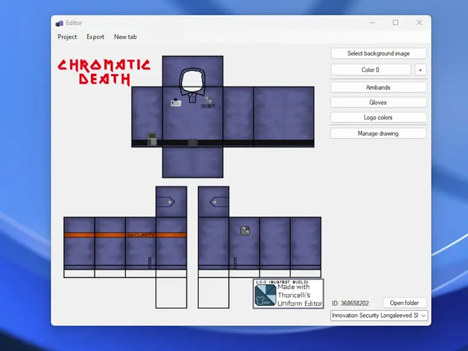
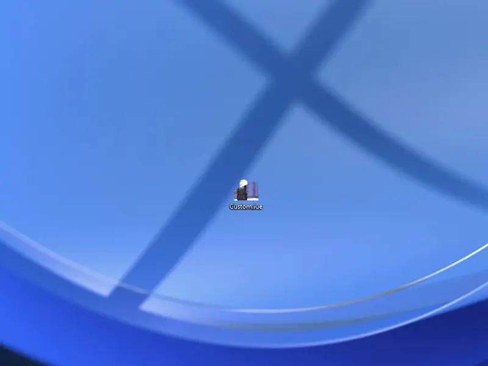
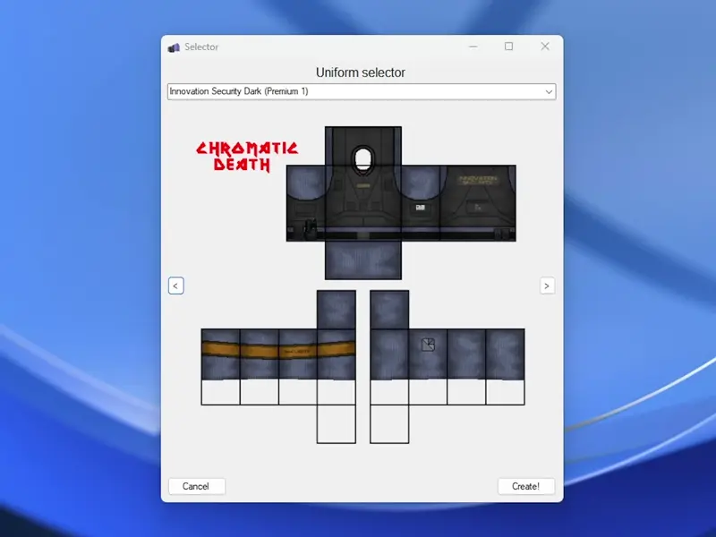

Hello everyone, version 1.0.0 is finally here.

Here are some of its new features.

<!--more-->

# New features

## Logo color switching support

Logos can now have theirs colors switched.
There are 3 presets that can be chosen to switch the colors to.
Managing and adding presets is a planned feature for the editor.

## Glove, shoe, armband, holster switching support

Version 1.0.0 allows you to switch different parts of the uniform.
Credits are added as needed.

## Exporting and loading a uniforms to a file

Uniforms can be exported to a file, they are saved as JSON information.

- To export a uniform press Export -> To file in the toolstrip bar.
- To import a uniform press File -> Import -> Preview / Add

## Default colors for uniforms

## General tweaks / bug fixes.

- Shading is now seperated on the builders tab.
- Uniform lines are seperated on the builders tab.
- Fixed an issue where visible lines would show when using fades
- Fixed Artic Task uniform and Digital Camo (thanks to Justy)
- Reworked the updater to not update automatically, and added a versioning system that checks if it is compatible with the current tool version.

## Link

[https://github.com/thoricelli/Innovation-Uniform-Editor/releases/tag/v1.0.0](https://github.com/thoricelli/Innovation-Uniform-Editor/releases/tag/v1.0.0)
